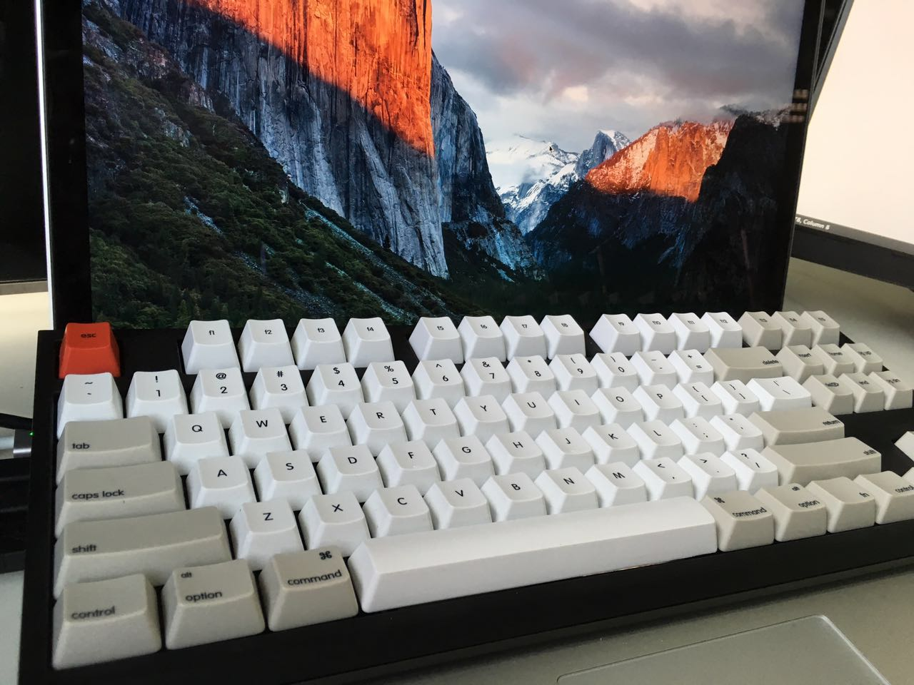
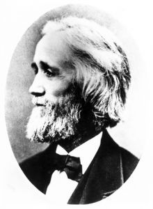
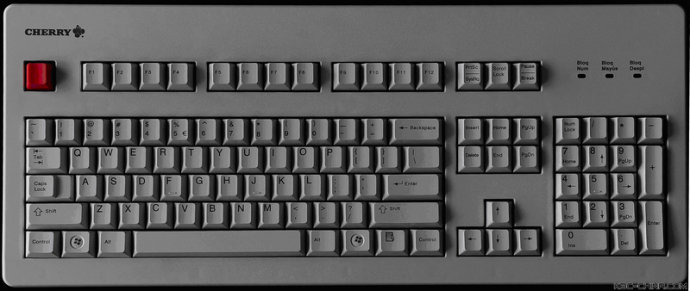
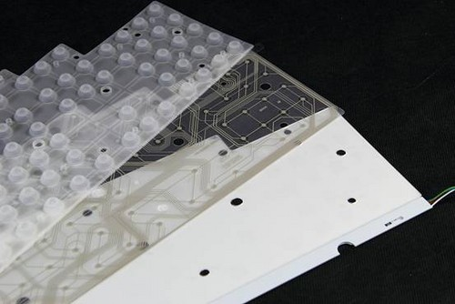
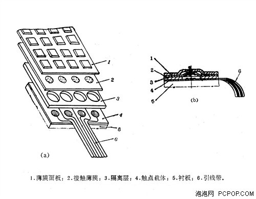
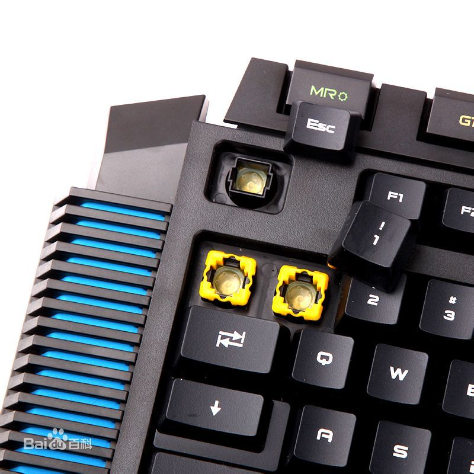
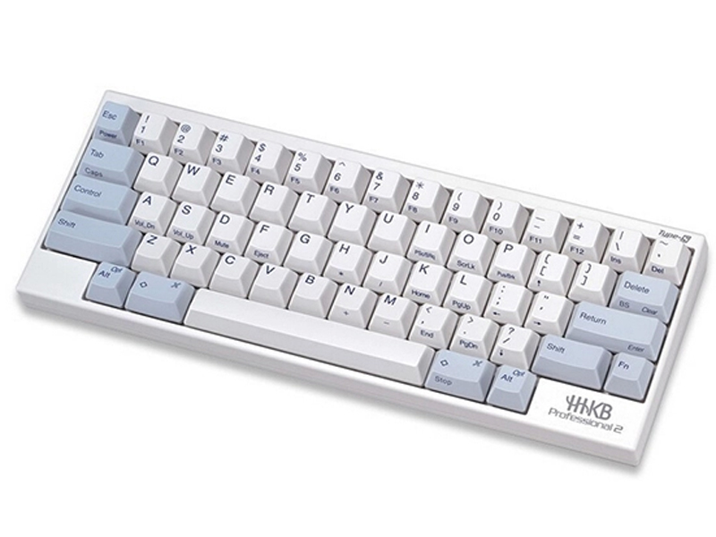
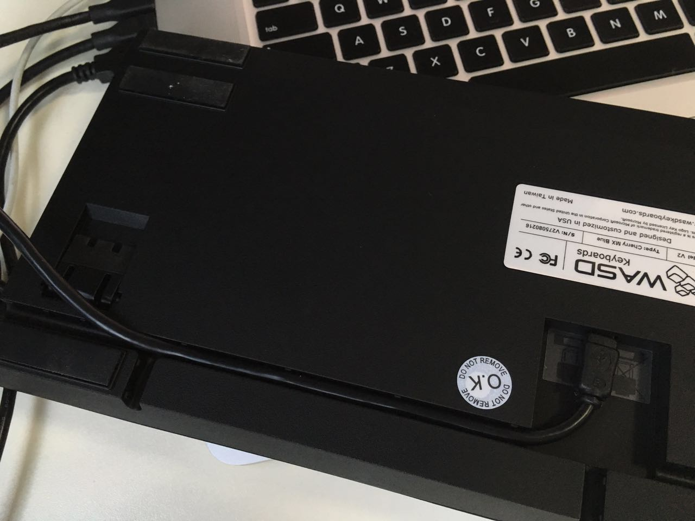

# 你们都谈创业，我来谈谈机械键盘（科普·选购·杂谈）

在杭州的某个创业园的窗边工位，时间是 2015.10.19 日的下午，已入秋的季节， 阳光赶走了早晨的寒意， 恰到好处的洒在我的 [WASD-青轴-黑座白键-87键-145$-机械键盘](http://www.wasdkeyboards.com/) 上，此刻敲打键盘清脆的声音似乎让我忘却了"互联网"的浮躁， 你们都谈创业，谈融资，谈 O2O、P2P，好，我只想谈谈机械键盘。

先 po 张图（大神表BS）

作为程序diao，机械键盘已经成为了我们日常 幸(苦)福(逼)生(搬)活(砖) 的标配，相信 贵diao们都应该对 机械键盘有些许了解，身边也一定有用机械键盘的大(屌)神(丝)， 他们都会说：

1. 我喜欢机械键盘， papapa ， 敲起来爽
2. 我喜欢机械键盘，装逼必备
3. 不是机械键盘还能好好的玩耍吗，游戏必备
4. 有感觉，感觉爽 =。= 

今天我也来装一下bi，从 科普 x 选购 x 杂谈 来唠一下机械键盘的嗑：

1. **科普**
    0. `键盘历史` 
    1. `键盘4大分类`
    2. `青红茶黑白轴` 
2. **选购**
    2. `机械键盘什么牌子好`
    3. `初级、中级、高级怎么选购机械键盘`
    4. `键盘布局，标准键盘，小键盘，87键`
    5. `蓝牙键盘`
    6. `人体工学键盘`
    6. `可编程键盘`
    7. `键帽选购`
    8. `背光`
3. **杂谈**
    0. `键盘布局` http://baike.baidu.com/view/277195.htm
    1. `键位冲突` http://baike.baidu.com/view/1036278.htm

# 科普篇

## 键盘历史
为了让大家更深入的了解机械键盘，得首先来review一下键盘史,谈到键盘，我们得谈克里斯托夫·拉森·肖尔斯(打字机之父)， 我们现在用的键盘的故事就是起源于他， 

在17世纪初，欧洲就有人发明了格式不太成熟的打字机，键盘就是应用在这些打字机上的。 在1868年， 我们敬爱的克里斯托夫·拉森·肖尔斯获得了打字机模型专利并取得打字机的经营权。  因为那时的键盘设计是 a.b.c.d.e.f.g 这样顺序设计布局的， 人们打字飞快，打字机受不了了，出现卡键现象，于是我们敬爱的克里斯托夫·拉森·肖尔斯发明了我们现在用的  q.w.e.r.t.y 布局的打字机， 有效的放慢了我们打字的速度(干) 

所以我们现在用的键盘通常是 101 或 102 个键的 称为 "QWERTY键盘" 。

## 键盘4大分类

键盘主要分为四大类别：

1. Mechanical 机械构造键盘  http://www.zbypc.com/show-75-22.html
2. Membrane 塑料薄膜构造键盘 
3. Conductive Rubber 导电橡胶式键盘 
4. Capacitives 静电电容键盘 http://gpc.pcgames.com.cn/295/2953731.html

### 机械键盘

我们的主角 Mechanical（此处应该记住，可用来装逼），应该说机械键盘是最早的键盘，采用类似金属接触式开关，工作原理是使触点导通或断开，具有工艺简单、噪音大、易维护、打字时节奏感强，长期使用手感不会改变等特点， 从结构来说，机械键盘的每一颗按键都有一个单独的Switch（也就是开关）来控制闭合，这个开关也被称为“轴”，依照微动开关的分类，机械键盘可分为茶轴、青轴、黑轴以及红轴。正是由于每一个按键都由一个独立的微动组成，因此按键段落感较强，从而产生适于游戏娱乐的特殊手感，故而通常作为比较昂贵的高端游戏外设，亦是程序员的理想设备。

早期服务器上配备的就是机械键盘，因为制作成本的原因，被后来的塑料薄膜构造键盘赶超，而近些年，因为机械键盘的手感和舒适度无可替代，机械键盘受到高端玩家的追捧。

最具有代表性的以品质优秀而著称的Cherry原厂键盘，以时尚、精美、简约外观取胜但又保持较高制作工艺的Filco，和在游戏玩家心目中有较高地位的 SteelSeries 等。 

主要的 OEM 制造代工厂 旭丽SILITEK、群光CHICONY、英群BTC、美蓓亚NMB

**优点**

    1.机械键盘最重要是轴，机械键盘比普通薄膜键盘寿命长,好的机械键盘寿命10多年甚至20多年
    2.机械键盘使用时间长久之后,按键手感变化很小,而薄膜则无法达到
    3.机械键盘不同的轴的按键手感都不相同,薄膜则触感单一
    4.机械键盘可以做到6键以上无冲,部分机械键盘可以全键无冲突,而6键以上无冲突的薄膜键盘较少（因此非常适合 游戏之用，大多数职业电竞选手都会使用机械键盘来提高水平）
    5.可以自己更换键帽,方便个性DIY

**缺点**

    1.售价偏高，因为成本较高，市场上大部分都在400-800元，更有上千元的也不足为奇
    2.虽然键盘有很长寿命，但是防水能力差，使用时需要多加小心

### 塑料薄膜构造键盘

Membrane 塑料薄膜构造键盘，现在我们的主流键盘。薄膜式键盘内部是一片双层胶膜，胶膜中间夹有一条条的银粉线，胶膜与按键对应的位置会有一碳心接点，按下按键后，碳心接触特定的几条银粉线，即会产生不同的讯号。就如机械式键盘的按键一样，每个按键都可送出不同的讯号。这种键盘的特点在于按键时噪音较低，每个按键下面的弹性硅胶可做防水处理，万一您不小心将倒在键盘上，较不易造成损坏，因此薄膜键盘又称为无声防水键盘。

 

 

**优点**

    1. 寿命长
    2. 制造成本低，价格低
    3. 低噪音
    4. 防水

**缺点**

    1. 手感差

### 导电橡胶式键盘

导电橡胶式键盘（Conductive Rubber）触点的结构是通过导电橡胶相连。键盘内部有一层凸起带电的导电橡胶，每个按键都对应一个凸起，按下时把下面的触点接通。这种类型键盘是市场由机械键盘向薄膜键盘的过渡产品。

## 静电电容键盘

接点静电电容键盘（Capacitives）使用类似电容式开关的原理，利用电容容量的变化来判断按键的开和关，在按下按键后，开关中电容容量发生改变，从而实现触发，整个过程不需要开关的闭合。正是由于无物理接触点就可以实现敲击，因而磨损更小，使用寿命更长。更稳定、迅速、全键无冲突、无比灵敏。通常作为比较昂贵的高端游戏外设，亦是程序员的理想设备。

看看和机械键盘结构有什么不同

很容易和机械键盘混淆，最常见的静电电容键盘就是 HHKB (happy hacking keyboard)

**优点** 

    1. 快
    2. 全键无冲突
    3. 无磨损，寿命长

**缺点**

    1. 特贵

[更多参考](http://baike.baidu.com/view/5425119.htm)

## 青红茶黑白轴

选择键盘的实质就是在选择键盘下面的控制开关，俗称轴。今天许多人用的机械键盘是Cherry生产的 MX 轴, 但是每个机械键盘的轴都有自己独特的特点。

### Cherry MX黑轴

黑轴被称为最原始最纯粹的机械轴，有着超短触发距离与最长使用寿命。机械感直爽：从顶部到底部下压时呈现直线状的压感，所以不用压到底部。整个控制开关的压力一般集中在中间，“触底”在键的底部，所以MX黑轴一般会被纳入针对游戏玩家的键盘，使得键盘双击很容易，不用担心自己是按了还是没按那个键、按地清不清晰。但是这种键盘的轴设计是整体的，按一个键的时候整个键盘的轴都在下压。这对于经常要打字的用户来说是件很烦的事情。

比较出名的键盘代表：Steelseries 7G游戏键盘、 ThermalTake Meka G Unit 、Meka G1系列游戏键盘。

### Cherry MX红轴

红轴较黑轴力度轻，同样是直上直下的爽快风格（无段落感）。图中显示开关也是个直线状的，自顶部到底部的开关，但只要一点点驱动力就可以触到开关的底部， 所以用起来会比较滑，导致个别用户容易误触，但不少玩家给予好评，如果搭配得当使用者可感受到丝绸般顺滑。目前很多游戏都跟红轴在合作。但是最流行的还是工作和娱乐两用的设计键盘。虽然没有强烈碰撞的感觉，但它仍然侧重游戏键盘。

出名的键盘：Corsair Vengence K60、Max Nighthawk X9 backlit keyboard，你也能在Das Model S专业键盘中找到。

### Cherry MX 茶轴

茶轴是轴中最全面的，段落感不像下面青轴那样明显，手指的感觉非常舒适，力度适中适合多种环境，无论是游戏还是打字都不错。可以看到在开关中间不远处，有一个软的隆起，这让你敲字的时候轻轻一带可能敲中了。这个设计对于游戏者的好处就是，执行双击的时候容易多了。因为那个隆起在中间，你可以按键的时候采取悬浮形式。但对于喜欢直上直下（黑轴、红轴）的用户来说，段落感并不是十全十美，买之前自己体验一下。

出名的键盘：Das Model S Ulimtate、DAS Model S职业键盘

###  Cherry MX青轴

 

青轴一般是打字员的梦想，在游戏键盘中并不是很流行，其特点是只有当声音响起的时候按键才被触发，因此打字的时候噼里啪啦，无论是指尖还是心理上都得到了极大满足。但是其“抽动性”打字和双击时效果并不是很好，因为触底比“触发”要高。这款特别适合文字工作者，但是要注意噪音大。

出名的键盘：雷蛇 BlackWidow Ultimate、“滴答”版的Das Model S职业键盘和Das Model S Ultimate版键盘。

### Cherry MX白轴

这种键盘轴现在都很难找到了，需要很高的“驱动力”，按键盘的时候会比一般键盘要用力，比MX棕轴更硬更坚实，之所以有人选择这种键盘是因为当摁键盘的时候触觉反馈特别强烈。

# 机械键盘选购

机械键盘的灵魂是手感，选购的条件除了 “$” 以外就是选择适合自己 feel 的键盘，所以我从以下几个方面来介绍：

    1. 品牌及价格
    2. 轴
    3. 键的数量，小键盘还是大键盘
    4. mac 和 windows 的区别
    5. 蓝牙 VS 线导
    6. 排线方式
    7. 增强功能

## 品牌

**大牌** 

1. 德国的樱桃Cherry 赛睿SteelSeries
2. 日本的Filco
3. 美国的雷蛇Razer
4. 罗技

有 $ 的主建议不拘小节，直接入这些牌子吧。 

**中低端**

1. 魔力鸭 
2. 凯酷
3. 艾芮克
4. 精灵
5. 海盗船
6. 酷冷至尊
7. 新贵 

价格 300 - 1000 左右，适合新手 

## 轴 

不同的轴段落感不同，使用起来也会差别很大，如果买错了轴，会感觉对机械键盘很失望， 所以建议选购的时候仔细看看上面对不同轴使用的讲解。

1. 新手建议买青轴，papapa的感觉很爽，
2. 办公环境不建议购买青轴，声音比较大会被骂屎，建议这种情况购买茶轴

## 键的数量

讲一个小故事，我的第一款机械键盘是 pocker 2， 迷你键盘，刚买来的时候觉得很 happy，外观很漂亮敲起来也很爽，但是发现SB了， 方向键是 fn + WASD。对于我这种极度依赖方向键的代码写手直接跪， 后来很长一段时间也没有习惯。 

所以大家选购机械键盘的时候特别需要注意的点是买多少键的， 

1. 67 mini键盘小巧漂亮，但通常不是标准键盘布局，方向键是重点关注的地方
2. 87 键， 除了没有数字键盘，其他符合标准键盘布局，用起来应该更容易习惯
3. 102 键盘，如果键盘买来基本放在家里排着不动，台式机，建议买大键盘 

## mac 和 windows 

mac 和 windows 键盘布局最大的区别就是 mac 有 command 键，windows 有 win 键， 所以买键盘的时候最好能够对应自己的系统，不然出现我同事那样将 cap lock 改为ctrl, alt 改为 command 就真是 SB 了 

## 蓝牙 VS 线导

桌面上一堆线的情况相比大家是遇到过，如果再加上键盘线，真会给线绕死，或者有时候USB口子不够的情况，所以出现了蓝牙键盘。

传统的线导的方式和蓝牙的方式各有优缺点

**蓝牙**

优点

    1. 不用 USB 线
    2. 放置灵活

缺点

    1. 充电
    2. 可能出现不灵敏
    3. 价格更贵

**线导**

优点

    1. 不用充电
    2. 灵敏
    3. 价格便宜

缺点

    1. 线
    2. 占用USB口

## 排线方式

大家看看文章顶部我 po 的图， 键盘是放置在电脑上面的， 这样的 好处是我可以同时使用机械键盘和原有的触摸板， 完美替换原来的键盘， 要做到这点要注意：

1. 键盘要足够的大，不然会压着下面的键
2. 导线的排线方式重底部绕开，没有抵到屏幕如下图：
 

更具大家的需求来看，如果是台式机就不必担心这种情况

## 增强功能

为了让机械键盘更加炫酷，机械键盘除了打字还可以编程， 还有炫酷的彩虹LED背光，还有炫酷的键帽推荐，根据自己的需求，我觉得都可以适度考虑， 除了装逼以外机械键盘的本质需求还是手感

## 入门推荐

说了这么多，总该推荐几件入门键盘吧：

1. [入门 魔力鸭](https://detail.tmall.com/item.htm?spm=a220m.1000858.1000725.48.p1o9Tk&id=18215142878&skuId=34830467900&areaId=330100&cat_id=50024406&rn=be08f1543e835fe5c4640633f4eb9dc2&standard=1&user_id=807370847&is_b=1&from=jiketao)
2. [filco 圣手二代](https://detail.tmall.com/item.htm?spm=a220m.1000858.1000725.1.5KfmXu&id=19349573269&skuId=93020423778&areaId=330100&cat_id=50024406&rn=3bb219bcde21cd56ba079bb927ffa052&standard=1&user_id=1696199641&is_b=1&from=jiketao) 
3. [Cherry樱桃 G80-3800/3802 MX2.0C](https://detail.tmall.com/item.htm?spm=a220m.1000858.1000725.6.tnVjya&id=35192900490&skuId=101652632932&areaId=330100&cat_id=50024406&rn=2efb3c601bebca82f233cd0f74c4f5aa&standard=1&user_id=1762621111&is_b=1)

高端玩家自觉步伐

## 杂谈

## 键盘布局

## QWERTY 键盘布局

键盘历史非常悠久，早在1714年，就开始相继有英、美、法、意、瑞士等国家的人发明了各种形式的打字机，最早的键盘就是那个时候用在那些技术还不成熟的打字机上的。直到1868年，“打字机之父”——美国人克里斯托夫·拉森·肖尔斯（Christopher Latham Sholes）获打字机模型专利并取得经营权经营，又于几年后设计出现代打字机的实用形式和首次规范了键盘，即“QWERTY”键盘。
为什么要将键盘规范成现在这样的“QWERTY”键盘按键布局呢？这是因为最初，打字机的键盘是按照字母顺序排列的，而打字机是全机械结构的打字工具，因此如果打字速度过快，某些键的组合很容易出现卡键问题，于是克里斯托夫·拉森·肖尔斯（Christopher Latham Sholes）发明了QWERTY键盘布局，他将最常用的几个字母安置在相反方向，最大限度增大重复敲键时间间隔以避免卡键。肖尔斯在1868年申请专利，1873年使用此布局的第一台商用打字机成功投放市场。这就是为什么有今天键盘的排列方式。

## DVORAK 键盘布局

由于盲打技术的出现，使得击键速度足以满足日常工作的需要，然而在60年后（1934年），华盛顿一个叫德沃拉克（Dvorak）的人为使左右手能交替击打更多的单词又发明了一种新的排列方法，这个键盘可缩短训练周期1/2时间，平均速度提高35%。DVORAK键盘布局原则是：1、尽量左右手交替击打，避免单手连击；2、越排击键平均移动距离最小；3、排在导键位置应是最常用的字母。

## MALT 键盘布局

# 参考及扩展阅读

- [机械键盘键帽](http://www.zbypc.com/show-75-20.html)
- [机械键盘轴的组成](http://www.zbypc.com/show-75-21.html)
- [克里斯托夫·拉森·肖尔斯](http://www.baike.com/wiki/%E5%85%8B%E9%87%8C%E6%96%AF%E6%89%98%E5%A4%AB%C2%B7%E6%8B%89%E6%A3%AE%C2%B7%E8%82%96%E5%B0%94%E6%96%AF)
- [机械键盘的历史](http://www.zbypc.com/show-75-22.html)
- [使用机械键盘 的体验如何](http://www.zhihu.com/question/20232005)

1迷你      